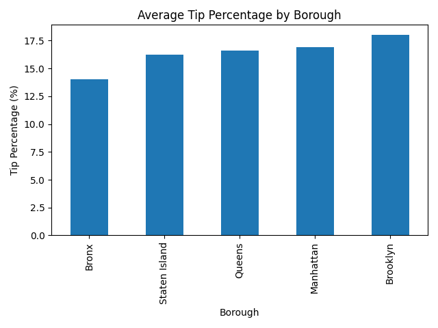

# NYC Tips Analytics

End-to-end Python data analytics project exploring NYC restaurant tipping behavior using transaction-level data.

This project analyzes tipping patterns across **days of the week** and **NYC boroughs** to uncover customer behavior trends and practical business insights.

---

## Objective
Analyze tipping behavior by calculating key metrics (total revenue, average tip %) and identifying patterns by day and borough.

---

## Visualizations

### Average Tip Percentage by Day


### Average Tip Percentage by Borough


---

## Key Insights
- The highest average tipping percentage occurs on **Sundays**.
- The overall average tip percentage across transactions is **~16.63%**.
- **Brooklyn** shows the highest average tip percentage among boroughs (based on this dataset).
- Location context (borough) adds a geo-analytics layer that can support staffing and pricing strategy.

---

## Tech Stack
- Python
- pandas
- matplotlib
- CSV data processing

---

## Files in this Project
- `Tips.csv` — dataset used for analysis  
- `tips_analyzer.py` — main Python analysis script  
- `results.txt` — saved summary output  
- `avg_tip_by_day.png` — day-level visualization  
- `avg_tip_by_borough.png` — borough-level visualization  

---

##  How to Run
1. Open Terminal in the project folder  
2. Run:

```bash
python3 tips_analyzer.py