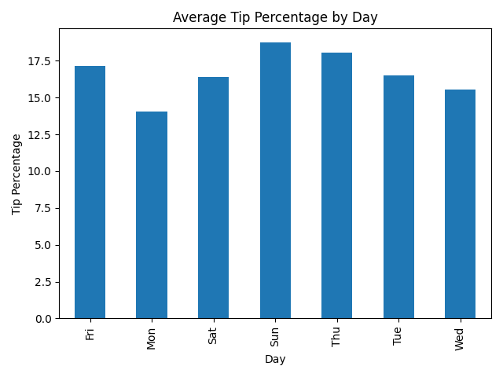

# NYC Tips Analytics

This project analyzes restaurant tipping behavior in New York City using Python.

## Objective
To calculate key metrics (total revenue, average tip %) and identify which day of the week has the highest average tipping. ## 📊 Visualization

Average tip percentage by day of the week:




## Tools Used
- Python
- pandas
- matplotlib

## Files in this Project
- `Tips.csv` — dataset used for analysis  
- `tips_analyzer.py` — main Python script  
- `results.txt` — saved summary output  
- `avg_tip_by_day.png` — bar chart visualization  

## Key Findings
- Total revenue: $1159.75  
- Average tip percentage: 16.63%  
- Best tipping day: Sunday  

## How to Run
1. Open Terminal in the project folder
2. Run:
   ```bash
   python3 tips_analyzer.py

